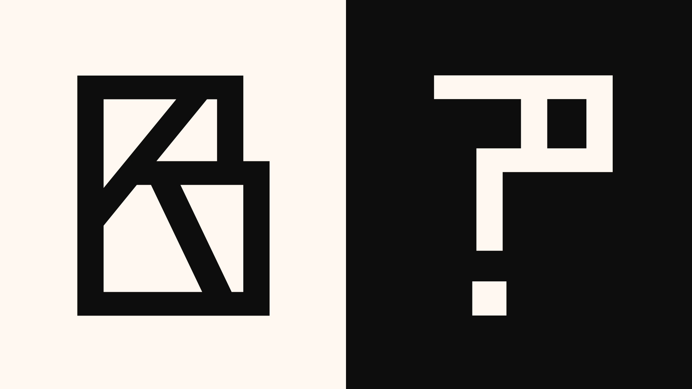

# Alsace

### English

Alsace is a font designed in reference to the timber frame typical of the Alsatian traditional houses. This building structure first answered to technical principles (triangulation of the timber frames, rigidity of the framework) but the carpenters also included various creative elements with symbolic meaning. For instance, the *Mann*, is composed with vertical and oblique beam which help to maintain the structure. It takes the shape of a double “K” side by side which recalls the silhouette of a man, legs apart and arms raised to the sky.

The Alsatian timber frames, by their graphic and semantics richness, were the inspiration for the creation, of the 2019 Graduation Show at the School of the arts of the Rhin in Strasbourg (HEAR). From an imagined facade, we created a series of drop initials that were part of the visual identity of the event (posters, catalogue, invitation cards, signage etc.).

We wanted to extend this work beyond the initial commission by developing a complete set of characters drawn from these drop initials. The Alsace is edited in two weight (Regular and Bold). Like the half-timbered facades, the design of Alsace is a combination of exclusively verticals, obliques and horizontals lines, always seeking the point of balance between a readable letter and an ornamental form.

Credits: Pilote Paris, 2021 / Acknowledgement: Laurane Perrot

### Français

L’Alsace est une typographie créée à partir des structures à colombages des maisons alsaciennes. Ces structures répondaient d’abord à des principes techniques (triangulation des pans de bois, rigidité de l’ossature) mais les charpentiers incluaient aussi divers éléments créatifs porteurs de signification symbolique. Le *Mann* par exemple, composé de poutres verticales et obliques, contribuait au maintien de la structure. Il prenait la forme de deux « K » opposés l’un à l’autre, évoquant ainsi la silhouette d’un homme jambes écartées et bras levés au ciel.

Les colombages, de par leur richesse graphique et sémantique, nous ont servi d’inspiration pour la création en 2019 de l’identité visuelle des diplômes de la Haute école des arts du Rhin (HEAR) à Strasbourg. À partir de la réalisation d’une façade imaginée, nous avons dessiné une série de lettrines utilisées dans le déploiement des supports de l’identité visuelle (affiches, catalogue, carton d’invitation, signalétique, etc.).

Nous avons souhaité prolonger ce travail au-delà de la commande initiale en développant un ensemble complet de caractères dessinés à partir de ces lettrines. L’Alsace est éditée en deux graisses (Regular et Bold). À l’instar des colombages, le dessin de l’Alsace est une combinaison exclusivement faite de verticales, d’obliques et d’horizontales cherchant toujours le point d’équilibre entre une lettre lisible et une forme ornementale.

Crédits: Pilote Paris, 2021 / Remerciements: Laurane Perrot

## Contact

[Visitez le mini-site / Visit the mini-site](https://alsace.piloteparis.com)

[Instagram](https://www.instagram.com/pilote_paris/)

[E-mail](mailto:contact@piloteparis.com)

## License

Alsace is licensed under the [SIL Open Font License](http://scripts.sil.org/OFL), version 1.1
